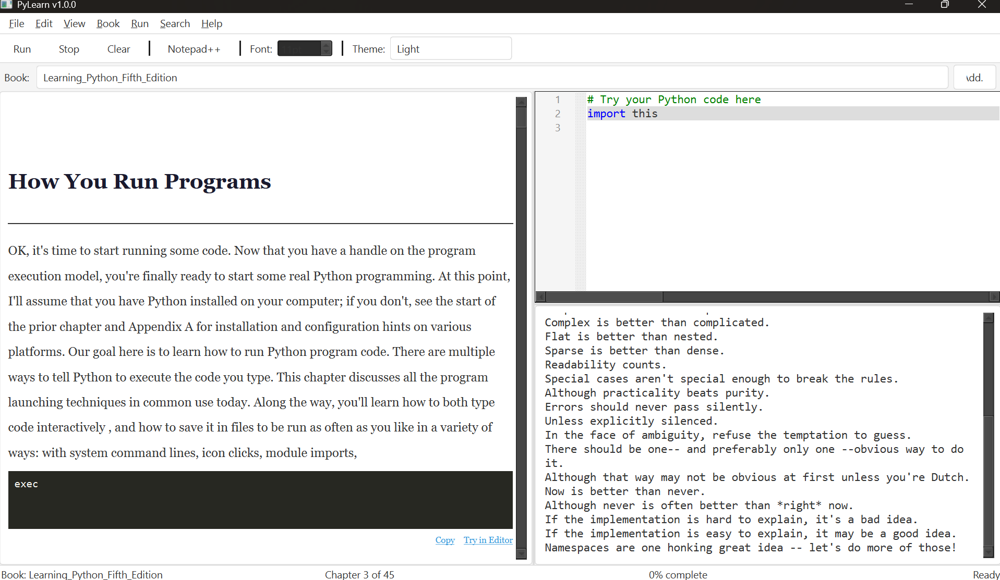
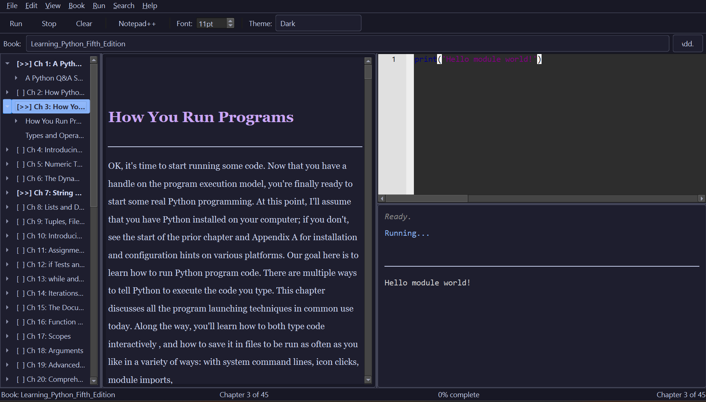
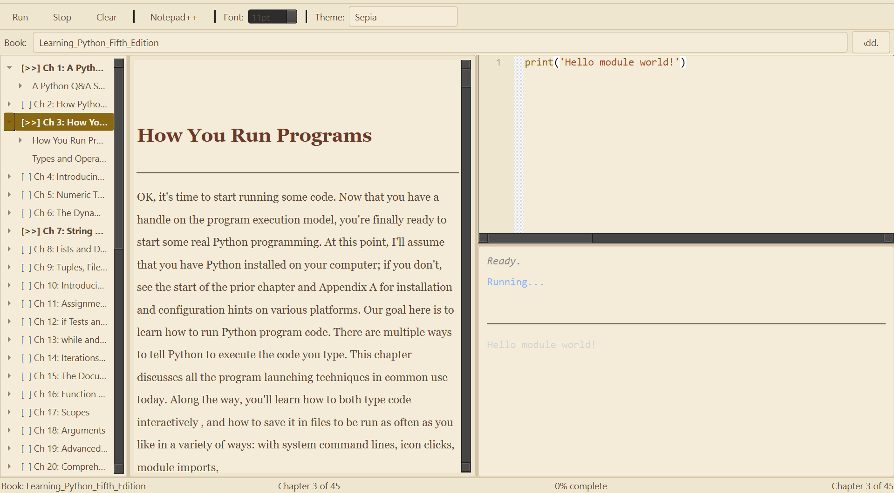
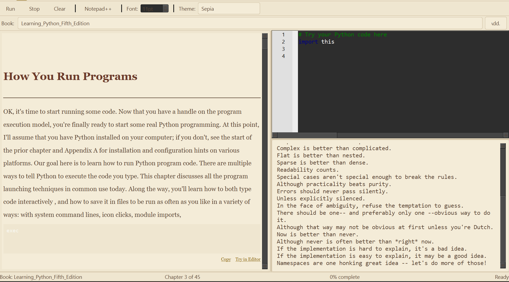

# PyLearn

[](https://github.com/fritz99-lang/pylearn/actions/workflows/ci.yml)
[](LICENSE)
[](https://www.python.org/)
[](https://mypy-lang.org/)

An interactive desktop app for learning programming from PDF books. Split-pane interface with a book reader on the left and a code editor + console on the right — read the book, write code, and run it all in one place.

## Screenshots

**Light mode** — reading with Book menu open:



**Dark mode** — reading with code execution:



**Sepia mode** — reading view:



**Sepia mode** — running code (Zen of Python):



## Features

- **PDF Book Reader** — Parses PDF books into structured, styled HTML with headings, body text, and syntax-highlighted code blocks
- **Code Editor** — QScintilla-powered editor with syntax highlighting, line numbers, auto-indent, and configurable font/tab settings
- **Code Execution** — Run Python code directly from the editor with output displayed in an integrated console (30s timeout, sandboxed subprocess)
- **Table of Contents** — Auto-generated chapter navigation from PDF structure
- **Progress Tracking** — SQLite database tracks chapter completion status, bookmarks, and notes per book
- **Bookmarks & Notes** — Save bookmarks and attach notes to any page
- **Multiple Book Profiles** — Supports Python, C++, and HTML/CSS books with per-book font classification profiles
- **Themes** — Light, dark, and sepia themes for the reader panel
- **External Editor** — Launch code in Notepad++ or your preferred external editor
- **Parsed Content Caching** — PDF parsing results cached as JSON for fast subsequent loads

## Requirements

- Python 3.12+
- Windows, macOS, or Linux

## Installation

```bash
# Clone the repository
git clone https://github.com/fritz99-lang/pylearn.git
cd pylearn

# Create a virtual environment
python -m venv .venv
source .venv/bin/activate    # Linux/macOS
.venv\Scripts\activate       # Windows

# Install the app
pip install -e .

# Or with dev tools (pytest, mypy)
pip install -e ".[dev]"
```

You can also install directly from GitHub without cloning:

```bash
pip install git+https://github.com/fritz99-lang/pylearn.git
```

### Platform Notes

| Platform | Notes |
|----------|-------|
| **Windows** | Works out of the box with Python 3.12+ |
| **Linux** | Install system deps first: `sudo apt-get install libegl1 libxkbcommon0` |
| **macOS** | May need Xcode command line tools: `xcode-select --install` |

## Setup

1. **Copy the example config files:**

   ```bash
   cp config/app_config.json.example config/app_config.json
   cp config/books.json.example config/books.json
   cp config/editor_config.json.example config/editor_config.json
   ```

2. **Register your books** by editing `config/books.json`:

   ```json
   {
     "books": [
       {
         "book_id": "learning_python",
         "title": "Learning Python",
         "pdf_path": "/path/to/your/book.pdf",
         "profile_name": "learning_python"
       }
     ]
   }
   ```

   Available `profile_name` values: `learning_python`, `cpp_generic`, or leave empty for auto-detection.

3. **Launch the app:**

   ```bash
   python -m pylearn
   ```

## Usage

| Area | What it does |
|------|-------------|
| **Left panel** | Book reader — navigate chapters via the table of contents sidebar |
| **Right panel (top)** | Code editor — write or paste code from the book |
| **Right panel (bottom)** | Console — see output from running your code |
| **Toolbar** | Theme switching, bookmarks, notes, progress tracking |

## Keyboard Shortcuts

| Category | Shortcut | Action |
|----------|----------|--------|
| **Navigation** | `Alt+Left` / `Alt+Right` | Previous / next chapter |
| | `Ctrl+M` | Mark chapter complete |
| | `Ctrl+T` | Toggle TOC panel |
| **Search** | `Ctrl+F` | Find in current chapter |
| | `Ctrl+Shift+F` | Search all books |
| **Code** | `F5` | Run code |
| | `Shift+F5` | Stop execution |
| | `Ctrl+S` | Save code to file |
| | `Ctrl+O` | Load code from file |
| | `Ctrl+E` | Open in external editor |
| **View** | `Ctrl+=` / `Ctrl+-` | Increase / decrease font size |
| | `Ctrl+1` / `2` / `3` | Focus TOC / reader / editor |
| **Notes** | `Ctrl+B` | Add bookmark |
| | `Ctrl+N` | Add note |
| **Help** | `Ctrl+/` | Show shortcuts dialog |

## Configuration

All config files live in `config/` and are JSON:

- **`app_config.json`** — Window size, theme, splitter positions, last opened book
- **`books.json`** — Registered books with PDF paths and profile names
- **`editor_config.json`** — Editor font size, tab width, line numbers, execution timeout

## Development

```bash
# Run all tests (702 tests)
pytest tests/ -v

# Skip slow tests
pytest tests/ -v -m "not slow"

# Type checking
mypy src/pylearn/

# Pre-parse books to cache
python scripts/parse_books.py

# Analyze PDF font metadata (useful for creating new book profiles)
python scripts/analyze_pdf_fonts.py path/to/book.pdf
```

## Project Structure

```
src/pylearn/
  parser/       PDF parsing, font analysis, content classification, caching
  renderer/     HTML rendering, syntax highlighting, themes
  executor/     Subprocess-based code execution with sandboxing
  ui/           PyQt6 widgets (main window, reader, editor, console, dialogs)
  core/         Config, database, models, constants
  utils/        Text utilities, error handling
config/         User-specific JSON config (not committed; see *.json.example)
data/           SQLite database + parsed PDF cache (not committed)
tests/          702 tests (500+ unit + 150+ integration)
scripts/        Utility scripts for PDF analysis and book parsing
```

## Troubleshooting

**App won't start**
- Make sure PyQt6 is installed: `pip install PyQt6 PyQt6-QScintilla`
- Verify Python 3.12+: `python --version`
- On Linux, install system deps: `sudo apt-get install libegl1 libxkbcommon0`

**PDF not found**
- Check the `pdf_path` in `config/books.json` — use absolute paths
- Verify the file exists at the specified path

**Book not parsing correctly**
- Delete the cached JSON in `data/` and re-launch to force a re-parse
- Check if a matching `profile_name` exists in `book_profiles.py`
- Run `python scripts/analyze_pdf_fonts.py path/to/book.pdf` to inspect font metadata

**Code execution timeout**
- Default timeout is 30 seconds
- Increase it in `config/editor_config.json` by setting `"execution_timeout"` to a higher value

## Acknowledgments

Built in partnership with [Claude Code](https://claude.ai/claude-code) (Anthropic) — architecture, implementation, testing, and code review.

## License

[MIT](LICENSE) - Copyright (c) 2026 Nathan Tritle
